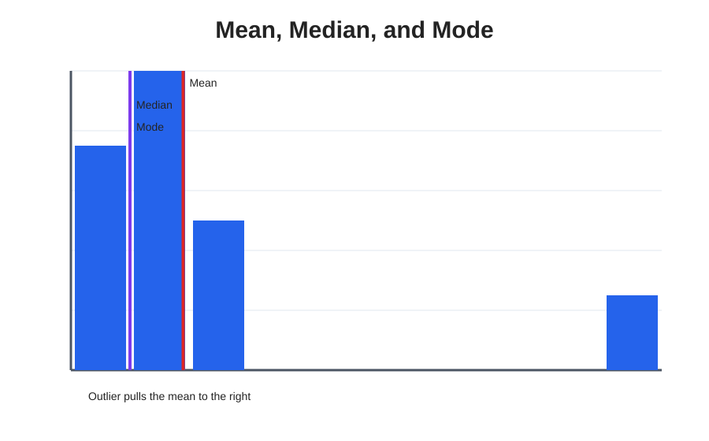
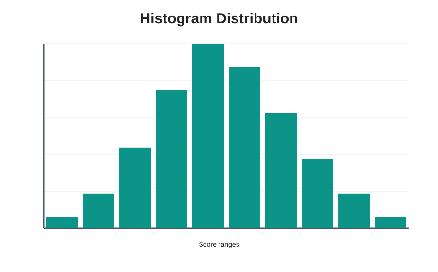
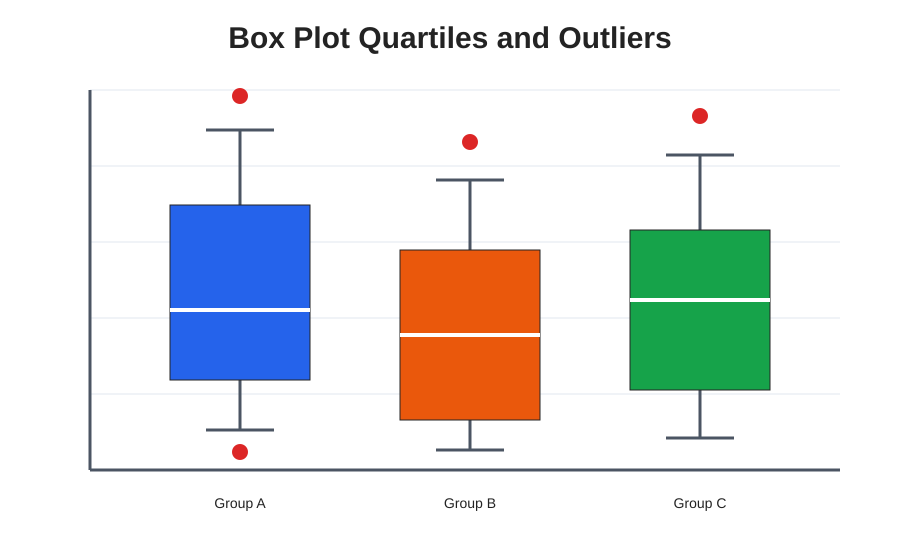
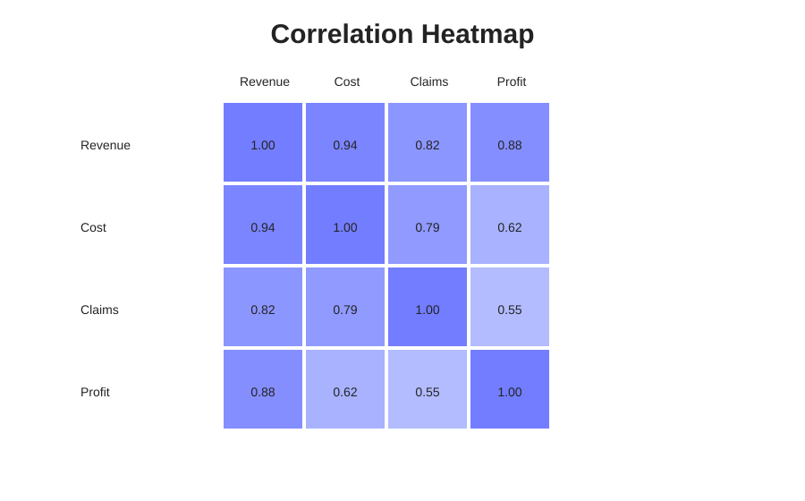
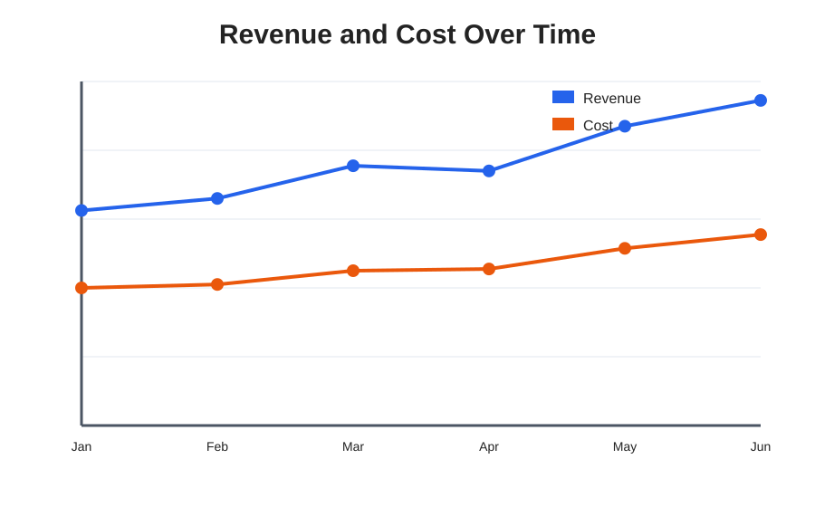
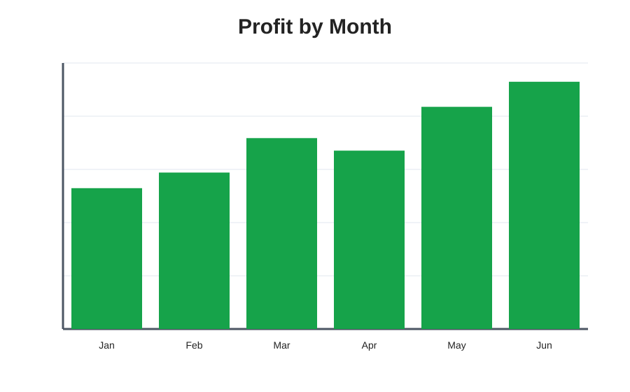
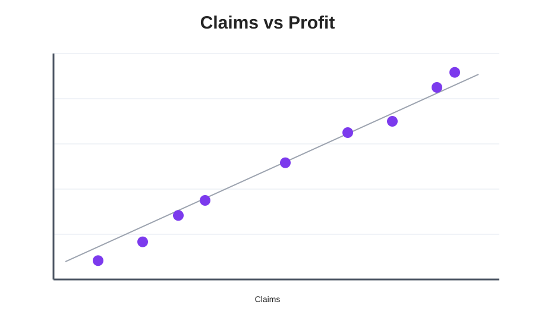
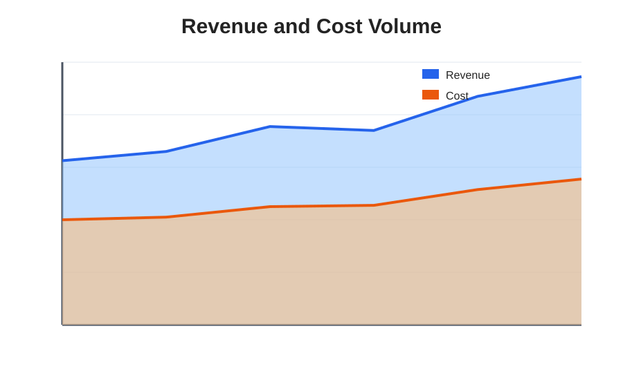
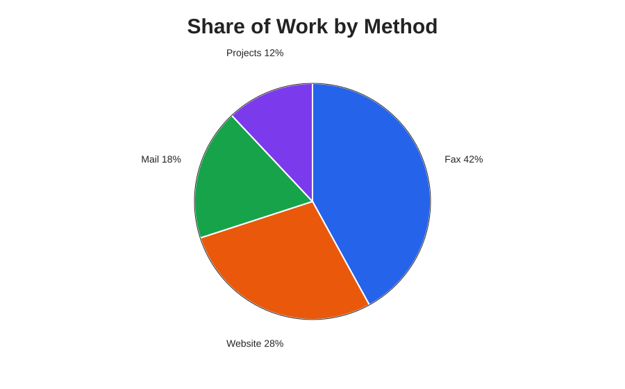

# Complete pandas Manual: Practical Data Analysis, Statistics, and Plotting

**Author:** Generated for Chris Fonseca  
**Format:** Markdown manual with linked image assets  
**Main libraries:** `pandas`, `numpy`, `matplotlib`  
**Recommended use:** Open this `.md` file in VS Code, GitHub, Obsidian, or any Markdown viewer. Keep the `pandas_manual_assets` folder next to this file so images load correctly.

---

## Table of Contents

1. [How to Use This Manual](#1-how-to-use-this-manual)
2. [What pandas Is and Why It Matters](#2-what-pandas-is-and-why-it-matters)
3. [Installation and Setup](#3-installation-and-setup)
4. [Import Conventions](#4-import-conventions)
5. [Core pandas Objects](#5-core-pandas-objects)
6. [Creating DataFrames](#6-creating-dataframes)
7. [Reading and Writing Files](#7-reading-and-writing-files)
8. [Inspecting Data](#8-inspecting-data)
9. [Selecting Columns and Rows](#9-selecting-columns-and-rows)
10. [Filtering Data](#10-filtering-data)
11. [Creating, Updating, and Removing Columns](#11-creating-updating-and-removing-columns)
12. [Index Basics](#12-index-basics)
13. [Sorting and Ranking](#13-sorting-and-ranking)
14. [Handling Missing Data](#14-handling-missing-data)
15. [Data Types and Type Conversion](#15-data-types-and-type-conversion)
16. [String/Text Operations](#16-stringtext-operations)
17. [Date and Time Operations](#17-date-and-time-operations)
18. [Conditional Logic in pandas](#18-conditional-logic-in-pandas)
19. [Apply, Map, Replace, and Vectorization](#19-apply-map-replace-and-vectorization)
20. [Grouping and Aggregation](#20-grouping-and-aggregation)
21. [Pivot Tables and Cross Tabs](#21-pivot-tables-and-cross-tabs)
22. [Reshaping Data](#22-reshaping-data)
23. [Combining DataFrames](#23-combining-dataframes)
24. [Duplicates and Data Quality Checks](#24-duplicates-and-data-quality-checks)
25. [Working with Excel Reports](#25-working-with-excel-reports)
26. [Basic Statistics with pandas](#26-basic-statistics-with-pandas)
27. [Statistics Interpretation Guide](#27-statistics-interpretation-guide)
28. [Charts for Understanding Statistics](#28-charts-for-understanding-statistics)
29. [Plotting with pandas and Matplotlib](#29-plotting-with-pandas-and-matplotlib)
30. [How to Read Common Plot Types](#30-how-to-read-common-plot-types)
31. [Practical Orders and Inventory Example](#31-practical-orders-and-inventory-example)
32. [Method Chaining](#32-method-chaining)
33. [Performance Tips](#33-performance-tips)
34. [Additional pandas Operations](#34-additional-pandas-operations)
35. [MultiIndex and Hierarchical Data](#35-multiindex-and-hierarchical-data)
36. [Cumulative, Rolling, and Window Calculations](#36-cumulative-rolling-and-window-calculations)
37. [Binning, Bucketing, and Segmentation](#37-binning-bucketing-and-segmentation)
38. [Working with Many Files, JSON, and SQL](#38-working-with-many-files-json-and-sql)
39. [Styling Tables and Creating Review Outputs](#39-styling-tables-and-creating-review-outputs)
40. [Common Errors and How to Fix Them](#40-common-errors-and-how-to-fix-them)
41. [Mini Cheat Sheet](#41-mini-cheat-sheet)
42. [References](#42-references)

---

# 1. How to Use This Manual

This manual is designed to be both a learning guide and a practical reference.

Each important pandas topic includes:

- What the concept means.
- Why it matters.
- A realistic example.
- How to interpret the result.
- Common mistakes to avoid.

You can read it from top to bottom, or you can jump directly to the section you need.

The examples use small datasets so the logic is easy to understand. In real work, the same code patterns apply to large Excel files, CSV reports, order reports, audit logs, productivity reports, and automation outputs.

---

# 2. What pandas Is and Why It Matters

`pandas` is a Python library for working with structured data. Structured data means data organized in rows and columns, like an Excel worksheet, CSV file, SQL table, or report export.

In pandas, the most important object is the **DataFrame**.

A DataFrame is basically a table:

- Rows represent records.
- Columns represent fields.
- Each column has a name.
- Each row has an index.

Example:

```python
import pandas as pd

df = pd.DataFrame({
    "Order": ["A100", "A101", "A102"],
    "Budgeted": [100.00, 250.00, 175.00],
    "Actual": [80.00, 250.00, 150.00]
})

print(df)
```

Output:

```text
  Order  Budgeted  Actual
0  A100     100.0     80.0
1  A101     250.0    250.0
2  A102     175.0    150.0
```

Why pandas matters:

- It reads Excel, CSV, JSON, SQL, and many other formats.
- It cleans messy data.
- It filters, groups, summarizes, and reshapes data.
- It calculates statistics.
- It creates charts.
- It works well with automation scripts.
- It can replace many repetitive Excel tasks.

---

# 3. Installation and Setup

## 3.1 Install pandas

In a terminal:

```bash
pip install pandas
```

For Excel support:

```bash
pip install openpyxl
```

For charts:

```bash
pip install matplotlib
```

For numerical operations:

```bash
pip install numpy
```

A common setup command is:

```bash
pip install pandas openpyxl matplotlib numpy
```

## 3.2 Verify installation

```python
import pandas as pd

print(pd.__version__)
```

If this prints a version number, pandas is installed correctly.

## 3.3 Recommended imports

```python
import pandas as pd
import numpy as np
import matplotlib.pyplot as plt
```

`pd`, `np`, and `plt` are standard aliases used by most pandas examples and documentation.

---

# 4. Import Conventions

The standard import convention is:

```python
import pandas as pd
```

This means you call pandas functions using `pd`:

```python
df = pd.DataFrame({"Name": ["Ana", "Luis"], "Score": [90, 85]})
```

You will also often see:

```python
import numpy as np
```

NumPy is useful for numerical operations and conditional logic:

```python
df["Status"] = np.where(df["Score"] >= 90, "Excellent", "Normal")
```

For plotting:

```python
import matplotlib.pyplot as plt
```

Example:

```python
df["Score"].plot(kind="bar")
plt.show()
```

---

# 5. Core pandas Objects

pandas mainly uses two objects:

1. `Series`
2. `DataFrame`

## 5.1 Series

A `Series` is a one-dimensional labeled array. You can think of it as one column.

```python
scores = pd.Series([90, 85, 100], name="Score")

print(scores)
```

Output:

```text
0     90
1     85
2    100
Name: Score, dtype: int64
```

Important details:

- The left side is the index.
- The right side is the value.
- A Series has one data type.

Common Series methods:

```python
scores.mean()
scores.median()
scores.max()
scores.min()
scores.sum()
scores.count()
```

## 5.2 DataFrame

A `DataFrame` is a two-dimensional table.

```python
df = pd.DataFrame({
    "Employee": ["Ana", "Luis", "Maria"],
    "Department": ["Operations", "Operations", "Finance"],
    "Orders": [50, 45, 60]
})

print(df)
```

Output:

```text
  Employee Department  Orders
0      Ana    Operations      50
1     Luis    Operations      45
2    Maria      Finance      60
```

A DataFrame contains:

- Column labels: `Employee`, `Department`, `Orders`
- Row index: `0`, `1`, `2`
- Values: the actual data cells

## 5.3 Series vs DataFrame

```python
single_column = df["Orders"]        # Series
multiple_columns = df[["Employee", "Orders"]]  # DataFrame
```

A single bracket with one column returns a Series:

```python
type(df["Orders"])
```

A double bracket returns a DataFrame:

```python
type(df[["Orders"]])
```

This matters because Series and DataFrames have different shapes and sometimes behave differently.

---

# 6. Creating DataFrames

## 6.1 From a dictionary of lists

This is one of the most common ways to create a DataFrame manually.

```python
df = pd.DataFrame({
    "Order": ["C001", "C002", "C003"],
    "Budgeted": [100, 200, 300],
    "Actual": [90, 210, 250]
})
```

Each dictionary key becomes a column name.

## 6.2 From a list of dictionaries

This is useful when each record comes as a separate dictionary.

```python
records = [
    {"Order": "C001", "Budgeted": 100, "Actual": 90},
    {"Order": "C002", "Budgeted": 200, "Actual": 210},
    {"Order": "C003", "Budgeted": 300, "Actual": 250},
]

df = pd.DataFrame(records)
```

This format is common when processing API responses or parsed JSON.

## 6.3 From a list of lists

```python
data = [
    ["C001", 100, 90],
    ["C002", 200, 210],
    ["C003", 300, 250],
]

columns = ["Order", "Budgeted", "Actual"]

df = pd.DataFrame(data, columns=columns)
```

This is useful when data is already arranged like rows.

## 6.4 Creating an empty DataFrame

```python
df = pd.DataFrame(columns=["Order", "Budgeted", "Actual"])
```

This is sometimes used when collecting rows in a loop. However, repeatedly appending rows to a DataFrame is inefficient. Usually, it is better to collect dictionaries in a list and convert to a DataFrame once.

Better pattern:

```python
rows = []

for order in ["C001", "C002", "C003"]:
    rows.append({"Order": order})

df = pd.DataFrame(rows)
```

---

# 7. Reading and Writing Files

## 7.1 Read CSV

```python
df = pd.read_csv("orders.csv")
```

Common options:

```python
df = pd.read_csv(
    "orders.csv",
    encoding="utf-8",
    dtype={"Order": "string"},
    parse_dates=["Order_Date"]
)
```

Explanation:

- `encoding="utf-8"`: tells pandas how text is encoded.
- `dtype={"Order": "string"}`: forces a column to be text.
- `parse_dates=["Order_Date"]`: converts a column to datetime.

## 7.2 Write CSV

```python
df.to_csv("output.csv", index=False)
```

Use `index=False` unless you intentionally want the pandas index saved as a column.

## 7.3 Read Excel

```python
df = pd.read_excel("orders.xlsx")
```

Read a specific sheet:

```python
df = pd.read_excel("orders.xlsx", sheet_name="Summary")
```

Read multiple sheets:

```python
sheets = pd.read_excel("orders.xlsx", sheet_name=None)

summary_df = sheets["Summary"]
detail_df = sheets["Detail"]
```

When `sheet_name=None`, pandas returns a dictionary where each key is a sheet name and each value is a DataFrame.

## 7.4 Write Excel

```python
df.to_excel("output.xlsx", index=False)
```

Write multiple sheets:

```python
with pd.ExcelWriter("report.xlsx", engine="openpyxl") as writer:
    summary_df.to_excel(writer, sheet_name="Summary", index=False)
    detail_df.to_excel(writer, sheet_name="Detail", index=False)
```

## 7.5 Read only specific columns

```python
df = pd.read_excel(
    "orders.xlsx",
    usecols=["Order", "Budgeted", "Actual"]
)
```

This is useful for large reports.

## 7.6 Skip rows

```python
df = pd.read_excel("orders.xlsx", skiprows=2)
```

This skips the first two rows. Useful when an Excel export has titles or notes above the actual headers.

## 7.7 Set header row

```python
df = pd.read_excel("orders.xlsx", header=1)
```

This tells pandas that row 2 in Excel should be used as the header row, because pandas uses zero-based row numbering.

---

# 8. Inspecting Data

Before cleaning or analyzing a file, inspect it.

## 8.1 First rows

```python
df.head()
```

Shows the first 5 rows.

```python
df.head(10)
```

Shows the first 10 rows.

## 8.2 Last rows

```python
df.tail()
```

Shows the last 5 rows.

## 8.3 Shape

```python
df.shape
```

Returns:

```text
(rows, columns)
```

Example:

```python
rows, columns = df.shape
print(f"Rows: {rows}, Columns: {columns}")
```

## 8.4 Column names

```python
df.columns
```

Convert columns to a list:

```python
list(df.columns)
```

## 8.5 Data types

```python
df.dtypes
```

This helps identify if numbers were accidentally loaded as text.

## 8.6 Summary info

```python
df.info()
```

This shows:

- Number of rows.
- Column names.
- Non-null count per column.
- Data type per column.
- Memory usage.

## 8.7 Summary statistics

```python
df.describe()
```

For numeric columns, this returns:

- Count
- Mean
- Standard deviation
- Minimum
- 25th percentile
- Median / 50th percentile
- 75th percentile
- Maximum

Include non-numeric columns:

```python
df.describe(include="all")
```

## 8.8 Unique values

```python
df["Status"].unique()
```

Number of unique values:

```python
df["Status"].nunique()
```

## 8.9 Value counts

```python
df["Status"].value_counts()
```

Include missing values:

```python
df["Status"].value_counts(dropna=False)
```

Normalize to percentages:

```python
df["Status"].value_counts(normalize=True)
```

---

# 9. Selecting Columns and Rows

## 9.1 Select one column

```python
df["Actual"]
```

This returns a Series.

## 9.2 Select multiple columns

```python
df[["Order", "Budgeted", "Actual"]]
```

This returns a DataFrame.

## 9.3 Select rows by position with `iloc`

`iloc` selects by integer position.

```python
df.iloc[0]
```

First row.

```python
df.iloc[0:5]
```

First five rows.

```python
df.iloc[0, 2]
```

Value at first row, third column.

## 9.4 Select rows/columns by label with `loc`

`loc` selects by labels.

```python
df.loc[0, "Actual"]
```

Row index `0`, column `Actual`.

Select multiple columns:

```python
df.loc[:, ["Order", "Actual"]]
```

Select rows and columns:

```python
df.loc[0:2, ["Order", "Budgeted", "Actual"]]
```

## 9.5 `loc` vs `iloc`

Use `loc` when you know names/labels.

```python
df.loc[df["Actual"] < df["Budgeted"], ["Order", "Actual", "Budgeted"]]
```

Use `iloc` when you know positions.

```python
df.iloc[:, 0:3]
```

---

# 10. Filtering Data

Filtering means keeping only rows that match a condition.

Example dataset:

```python
df = pd.DataFrame({
    "Order": ["C001", "C002", "C003", "C004"],
    "Budgeted": [100, 200, 300, 400],
    "Actual": [90, 210, 250, 400],
    "Status": ["Under Budget", "Over Budget", "Under Budget", "On Budget"]
})
```

## 10.1 Basic filter

```python
under_budget = df[df["Actual"] < df["Budgeted"]]
```

This keeps rows where actual spending is less than budgeted spending.

## 10.2 Multiple conditions with AND

Use `&` for AND.

```python
result = df[(df["Actual"] < df["Budgeted"]) & (df["Budgeted"] >= 300)]
```

Each condition must be wrapped in parentheses.

## 10.3 Multiple conditions with OR

Use `|` for OR.

```python
result = df[(df["Status"] == "Under Budget") | (df["Status"] == "Over Budget")]
```

## 10.4 NOT condition

Use `~` for NOT.

```python
not_correct = df[~(df["Status"] == "On Budget")]
```

## 10.5 Filter with `isin`

```python
selected = df[df["Status"].isin(["Under Budget", "Over Budget"])]
```

This is cleaner than many OR conditions.

## 10.6 Filter text contains

```python
matching_status = df[df["Status"].str.contains("budget", case=False, na=False)]
```

Explanation:

- `case=False`: ignore uppercase/lowercase.
- `na=False`: treat missing values as not matching.

## 10.7 Filter missing values

```python
missing_status = df[df["Status"].isna()]
```

Rows where Status is not missing:

```python
known_status = df[df["Status"].notna()]
```

## 10.8 Query syntax

```python
result = df.query("Actual < Budgeted")
```

Query syntax can be easier to read for simple numeric comparisons.

For column names with spaces:

```python
result = df.query("`Actual Amount` < `Budgeted Amount`")
```

---

# 11. Creating, Updating, and Removing Columns

## 11.1 Create a new column

```python
df["Variance"] = df["Budgeted"] - df["Actual"]
```

Positive variance means budgeted is greater than actual.

## 11.2 Create a column with conditional logic

```python
import numpy as np

df["Category"] = np.where(
    df["Actual"] < df["Budgeted"],
    "Under Budget",
    "Not Under Budget"
)
```

## 11.3 Multiple conditions with `np.select`

```python
conditions = [
    df["Actual"] < df["Budgeted"],
    df["Actual"] > df["Budgeted"],
    df["Actual"] == df["Budgeted"],
]

choices = ["Under Budget", "Over Budget", "On Budget"]

df["Budget_Status"] = np.select(conditions, choices, default="Review")
```

## 11.4 Update existing column

```python
df["Status"] = df["Status"].str.upper()
```

## 11.5 Update selected rows

```python
df.loc[df["Variance"] > 0, "Needs_Review"] = True
```

## 11.6 Drop a column

```python
df = df.drop(columns=["Needs_Review"])
```

Drop multiple columns:

```python
df = df.drop(columns=["Column1", "Column2"])
```

## 11.7 Rename columns

```python
df = df.rename(columns={
    "Actual Amt": "Actual",
    "Budgeted Amt": "Budgeted"
})
```

## 11.8 Reorder columns

```python
df = df[["Order", "Budgeted", "Actual", "Variance", "Budget_Status"]]
```

---

# 12. Index Basics

The index identifies rows.

By default, pandas creates a numeric index:

```text
0, 1, 2, 3, ...
```

## 12.1 Set a column as index

```python
df = df.set_index("Order")
```

Now Order becomes the row label.

## 12.2 Reset index

```python
df = df.reset_index()
```

This converts the index back into a normal column.

## 12.3 Why index matters

Some operations align by index. Example:

```python
s1 = pd.Series([10, 20, 30], index=["A", "B", "C"])
s2 = pd.Series([1, 2, 3], index=["B", "C", "D"])

print(s1 + s2)
```

Output:

```text
A     NaN
B    21.0
C    32.0
D     NaN
dtype: float64
```

pandas matched values by index label, not row position.

---

# 13. Sorting and Ranking

## 13.1 Sort by one column

```python
df = df.sort_values("Variance")
```

Descending:

```python
df = df.sort_values("Variance", ascending=False)
```

## 13.2 Sort by multiple columns

```python
df = df.sort_values(["Status", "Variance"], ascending=[True, False])
```

This sorts by Status alphabetically, then by Variance descending inside each Status.

## 13.3 Sort by index

```python
df = df.sort_index()
```

## 13.4 Ranking

```python
df["Variance_Rank"] = df["Variance"].rank(ascending=False)
```

Highest variance gets rank 1.

Dense ranking:

```python
df["Dense_Rank"] = df["Variance"].rank(method="dense", ascending=False)
```

Dense ranking does not skip numbers after ties.

---

# 14. Handling Missing Data

Missing data is common in real reports.

pandas usually represents missing values as:

- `NaN`
- `NaT` for missing dates
- `None` in object columns
- `pd.NA` in nullable columns

## 14.1 Detect missing values

```python
df.isna()
```

Count missing values per column:

```python
df.isna().sum()
```

Percentage missing:

```python
missing_pct = df.isna().mean() * 100
```

## 14.2 Filter rows with missing values

```python
missing_member_id = df[df["Member_ID"].isna()]
```

## 14.3 Fill missing values

```python
df["Status"] = df["Status"].fillna("Unknown")
```

Fill numeric values with zero:

```python
df["Actual"] = df["Actual"].fillna(0)
```

## 14.4 Fill with mean or median

```python
df["Actual"] = df["Actual"].fillna(df["Actual"].median())
```

Use this carefully. Filling financial values with mean or median can distort totals.

## 14.5 Drop rows with missing values

```python
df_clean = df.dropna()
```

Drop only if specific columns are missing:

```python
df_clean = df.dropna(subset=["Order", "Budgeted", "Actual"])
```

## 14.6 Drop columns with too many missing values

```python
threshold = len(df) * 0.7

df = df.dropna(axis=1, thresh=threshold)
```

This keeps columns that have at least 70% non-missing values.

---

# 15. Data Types and Type Conversion

Data types control how pandas interprets values.

Common pandas data types:

| Type | Meaning | Example |
|---|---|---|
| `int64` | Integer | 10 |
| `float64` | Decimal number | 10.5 |
| `object` | Usually text or mixed values | "ABC" |
| `string` | Text | "ABC" |
| `bool` | True/False | True |
| `datetime64[ns]` | Date/time | 2026-01-01 |
| `category` | Limited set of values | "Open", "Closed" |

## 15.1 Check data types

```python
df.dtypes
```

## 15.2 Convert to numeric

```python
df["Actual"] = pd.to_numeric(df["Actual"], errors="coerce")
```

`errors="coerce"` converts invalid values to missing values.

Example:

```python
s = pd.Series(["100", "200", "bad"])
pd.to_numeric(s, errors="coerce")
```

Output:

```text
0    100.0
1    200.0
2      NaN
dtype: float64
```

## 15.3 Convert to string

```python
df["Order"] = df["Order"].astype("string")
```

This is useful for IDs that may contain leading zeros.

## 15.4 Convert to date

```python
df["Order_Date"] = pd.to_datetime(df["Order_Date"], errors="coerce")
```

## 15.5 Convert to category

```python
df["Status"] = df["Status"].astype("category")
```

Category can save memory when a column has repeated values.

---

# 16. String/Text Operations

String methods are accessed through `.str`.

Example:

```python
df = pd.DataFrame({
    "Vendor": ["  Acme Supplies ", "BLUE RIVER", "northwind traders"]
})
```

## 16.1 Strip spaces

```python
df["Vendor"] = df["Vendor"].str.strip()
```

## 16.2 Uppercase/lowercase/title case

```python
df["Vendor_Upper"] = df["Vendor"].str.upper()
df["Vendor_Lower"] = df["Vendor"].str.lower()
df["Vendor_Title"] = df["Vendor"].str.title()
```

## 16.3 Contains

```python
df["Is_Blue_River"] = df["Vendor"].str.contains("blue", case=False, na=False)
```

## 16.4 Replace text

```python
df["Vendor"] = df["Vendor"].str.replace("BLUE", "Blue", regex=False)
```

## 16.5 Split text

```python
df = pd.DataFrame({"Full_Name": ["John Smith", "Maria Lopez"]})

df[["First_Name", "Last_Name"]] = df["Full_Name"].str.split(" ", n=1, expand=True)
```

## 16.6 Extract with regex

```python
df = pd.DataFrame({"Log": ["Paid at 150.00%", "Paid at 200.00%"]})

df["Percent"] = df["Log"].str.extract(r"(\d+\.\d+)%")
```

This extracts `150.00` and `200.00` from the text.

## 16.7 Clean column names

```python
df.columns = (
    df.columns
      .str.strip()
      .str.lower()
      .str.replace(" ", "_", regex=False)
)
```

Before:

```text
Customer DOB
```

After:

```text
customer_since
```

---

# 17. Date and Time Operations

Dates are very important in reports.

## 17.1 Convert to datetime

```python
df["Order_Date"] = pd.to_datetime(df["Order_Date"], errors="coerce")
```

## 17.2 Extract date parts

```python
df["Year"] = df["Order_Date"].dt.year
df["Month"] = df["Order_Date"].dt.month
df["Month_Name"] = df["Order_Date"].dt.month_name()
df["Day"] = df["Order_Date"].dt.day
df["Weekday"] = df["Order_Date"].dt.day_name()
```

## 17.3 Format dates as text

```python
df["Order_Date_Text"] = df["Order_Date"].dt.strftime("%m/%d/%Y")
```

For folder names:

```python
df["Month_Folder"] = df["Order_Date"].dt.strftime("%m.%Y")
df["Day_Folder"] = df["Order_Date"].dt.strftime("%m%d%y")
```

## 17.4 Date difference

```python
df["Days_Open"] = (df["Closed_Date"] - df["Open_Date"]).dt.days
```

## 17.5 Filter by date

```python
recent = df[df["Order_Date"] >= "2026-01-01"]
```

Between dates:

```python
mask = df["Order_Date"].between("2026-01-01", "2026-03-31")
quarter_1 = df[mask]
```

## 17.6 Group by month

```python
monthly = df.groupby(df["Order_Date"].dt.to_period("M"))["Actual"].sum()
```

Convert period back to timestamp for plotting:

```python
monthly.index = monthly.index.to_timestamp()
```

---

# 18. Conditional Logic in pandas

## 18.1 Simple condition

```python
df["Under Budget"] = df["Actual"] < df["Budgeted"]
```

This creates a Boolean column.

## 18.2 If/else with `np.where`

```python
df["Status"] = np.where(
    df["Actual"] < df["Budgeted"],
    "Under Budget",
    "Not Under Budget"
)
```

## 18.3 Multiple conditions with `np.select`

```python
conditions = [
    df["Actual"] < df["Budgeted"],
    df["Actual"] > df["Budgeted"],
    df["Actual"] == df["Budgeted"]
]

choices = ["Under Budget", "Over Budget", "On Budget"]

df["Status"] = np.select(conditions, choices, default="Review")
```

## 18.4 Conditional assignment with `loc`

```python
df["Needs_Review"] = False

df.loc[df["Variance"] > 100, "Needs_Review"] = True
```

## 18.5 Nested logic pattern

Avoid deeply nested `np.where` when possible. Use readable conditions.

Less readable:

```python
df["Category"] = np.where(df["Variance"] > 0, "Under Budget", np.where(df["Variance"] < 0, "Over Budget", "On Budget"))
```

More readable:

```python
conditions = [
    df["Variance"] > 0,
    df["Variance"] < 0,
    df["Variance"] == 0
]
choices = ["Under Budget", "Over Budget", "On Budget"]

df["Category"] = np.select(conditions, choices, default="Review")
```

---

# 19. Apply, Map, Replace, and Vectorization

## 19.1 Vectorized operations

Vectorized operations work on entire columns at once.

```python
df["Variance"] = df["Budgeted"] - df["Actual"]
```

This is fast and preferred.

## 19.2 `map`

Use `map` to convert values using a dictionary.

```python
status_map = {
    "U": "Under Budget",
    "O": "Over Budget",
    "C": "On Budget"
}

df["Status_Name"] = df["Status_Code"].map(status_map)
```

Values not found in the dictionary become missing.

## 19.3 `replace`

```python
df["Status"] = df["Status"].replace({
    "Under Budgeted": "Under Budget",
    "Savings Opportunity": "Under Budget"
})
```

## 19.4 `apply` on a column

```python
def classify_variance(value):
    if value > 0:
        return "Under Budget"
    elif value < 0:
        return "Over Budget"
    return "On Budget"


df["Category"] = df["Variance"].apply(classify_variance)
```

## 19.5 `apply` on rows

```python
def create_note(row):
    return f"Order {row['Order']} has variance {row['Variance']}"


df["Note"] = df.apply(create_note, axis=1)
```

Row-wise `apply` is flexible but slower than vectorized logic.

## 19.6 When to use each

| Task | Recommended tool |
|---|---|
| Simple math between columns | Vectorized operation |
| Simple if/else | `np.where` |
| Multiple if/else branches | `np.select` |
| Replace known values | `replace` or `map` |
| Custom row-based text | `apply(axis=1)` |
| Complex function per value | `apply` |

---

# 20. Grouping and Aggregation

Grouping means splitting data into groups and calculating summaries.

Example:

```python
df = pd.DataFrame({
    "Reviewer": ["Ana", "Ana", "Luis", "Luis", "Maria"],
    "Customer": ["A", "B", "A", "B", "A"],
    "Orders": [10, 20, 15, 25, 30],
    "Sales": [1000, 2500, 1500, 3000, 4000]
})
```

## 20.1 Group by one column

```python
by_reviewer = df.groupby("Reviewer")["Orders"].sum()
```

Output concept:

```text
Reviewer
Ana      30
Luis     40
Maria    30
Name: Orders, dtype: int64
```

## 20.2 Group by multiple columns

```python
by_reviewer_customer = df.groupby(["Reviewer", "Customer"])["Sales"].sum()
```

## 20.3 Multiple aggregations

```python
summary = df.groupby("Reviewer").agg(
    Total_Orders=("Orders", "sum"),
    Average_Orders=("Orders", "mean"),
    Total_Sales=("Sales", "sum"),
    Average_Sales=("Sales", "mean")
).reset_index()
```

This is one of the most useful pandas patterns.

## 20.4 Group and count rows

```python
counts = df.groupby("Reviewer").size().reset_index(name="Row_Count")
```

## 20.5 Group and count non-missing values

```python
counts = df.groupby("Reviewer")["Sales"].count()
```

`size()` counts rows.  
`count()` counts non-missing values.

## 20.6 Group by date period

```python
monthly = df.groupby(df["Date"].dt.to_period("M")).agg(
    Total_Sales=("Sales", "sum"),
    Order_Count=("Order", "nunique")
)
```

## 20.7 Transform

`transform` returns a value for every original row.

Example: calculate each row's percentage of reviewer total.

```python
df["Reviewer_Total"] = df.groupby("Reviewer")["Sales"].transform("sum")
df["Percent_of_Reviewer_Total"] = df["Sales"] / df["Reviewer_Total"]
```

This keeps the original row count.

---

# 21. Pivot Tables and Cross Tabs

Pivot tables summarize data in a spreadsheet-like way.

## 21.1 Basic pivot table

```python
pivot = pd.pivot_table(
    df,
    values="Sales",
    index="Reviewer",
    columns="Customer",
    aggfunc="sum",
    fill_value=0
)
```

Interpretation:

- Rows are reviewers.
- Columns are customers.
- Values are sales amounts.
- The aggregation is sum.

## 21.2 Multiple values

```python
pivot = pd.pivot_table(
    df,
    values=["Orders", "Sales"],
    index="Reviewer",
    columns="Customer",
    aggfunc="sum",
    fill_value=0
)
```

## 21.3 Add totals

```python
pivot = pd.pivot_table(
    df,
    values="Sales",
    index="Reviewer",
    columns="Customer",
    aggfunc="sum",
    fill_value=0,
    margins=True,
    margins_name="Total"
)
```

## 21.4 Cross tab

`crosstab` counts combinations of categories.

```python
ct = pd.crosstab(df["Reviewer"], df["Customer"])
```

Normalize to percentages:

```python
ct_pct = pd.crosstab(df["Reviewer"], df["Customer"], normalize="index")
```

This shows each reviewer's distribution across customers.

---

# 22. Reshaping Data

Reshaping changes the structure of your DataFrame.

## 22.1 Wide vs long format

Wide format:

| Reviewer | Jan | Feb | Mar |
|---|---:|---:|---:|
| Ana | 10 | 12 | 15 |
| Luis | 8 | 9 | 11 |

Long format:

| Reviewer | Month | Orders |
|---|---|---:|
| Ana | Jan | 10 |
| Ana | Feb | 12 |
| Ana | Mar | 15 |
| Luis | Jan | 8 |
| Luis | Feb | 9 |
| Luis | Mar | 11 |

Long format is usually better for analysis and plotting.

## 22.2 Melt wide to long

```python
wide = pd.DataFrame({
    "Reviewer": ["Ana", "Luis"],
    "Jan": [10, 8],
    "Feb": [12, 9],
    "Mar": [15, 11]
})

long = wide.melt(
    id_vars="Reviewer",
    var_name="Month",
    value_name="Orders"
)
```

## 22.3 Pivot long to wide

```python
wide_again = long.pivot(
    index="Reviewer",
    columns="Month",
    values="Orders"
).reset_index()
```

## 22.4 Stack and unstack

```python
summary = df.groupby(["Reviewer", "Customer"])["Sales"].sum()
```

This creates a Series with a multi-index.

Unstack:

```python
wide_summary = summary.unstack(fill_value=0)
```

Stack back:

```python
long_summary = wide_summary.stack()
```

---

# 23. Combining DataFrames

There are three common ways to combine DataFrames:

1. `concat`
2. `merge`
3. `join`

## 23.1 Concatenate rows

Use `concat` when stacking similar tables.

```python
january = pd.DataFrame({"Order": ["C001", "C002"], "Month": ["Jan", "Jan"]})
february = pd.DataFrame({"Order": ["C003", "C004"], "Month": ["Feb", "Feb"]})

all_orders = pd.concat([january, february], ignore_index=True)
```

Use `ignore_index=True` to create a new clean index.

## 23.2 Concatenate columns

```python
combined = pd.concat([df1, df2], axis=1)
```

This combines side by side by index alignment.

## 23.3 Merge like SQL joins

```python
orders = pd.DataFrame({
    "Order": ["C001", "C002", "C003"],
    "Vendor_ID": [1, 2, 1]
})

vendors = pd.DataFrame({
    "Vendor_ID": [1, 2],
    "Vendor_Name": ["Acme Supplies", "Blue River"]
})

merged = orders.merge(vendors, on="Vendor_ID", how="left")
```

## 23.4 Join types

| Join type | Keeps |
|---|---|
| `inner` | Only matching rows in both tables |
| `left` | All rows from left table, matches from right |
| `right` | All rows from right table, matches from left |
| `outer` | All rows from both tables |

## 23.5 Merge on different column names

```python
merged = orders.merge(
    vendors,
    left_on="Vendor_ID",
    right_on="ID",
    how="left"
)
```

## 23.6 Validate merge quality

```python
merged = orders.merge(
    vendors,
    on="Vendor_ID",
    how="left",
    validate="many_to_one"
)
```

This helps catch unexpected duplicate matches.

Common validations:

| Validation | Meaning |
|---|---|
| `one_to_one` | Each key appears once in each table |
| `one_to_many` | Left key unique, right key can repeat |
| `many_to_one` | Left key can repeat, right key unique |
| `many_to_many` | Both sides can repeat |

## 23.7 Indicator column

```python
merged = orders.merge(vendors, on="Vendor_ID", how="left", indicator=True)
```

This adds `_merge`:

- `both`
- `left_only`
- `right_only`

Useful for audit checks.

---

# 24. Duplicates and Data Quality Checks

## 24.1 Find duplicate rows

```python
duplicates = df[df.duplicated()]
```

## 24.2 Find duplicate based on specific columns

```python
duplicates = df[df.duplicated(subset=["Order"], keep=False)]
```

`keep=False` shows all duplicated records.

## 24.3 Drop duplicates

```python
df_unique = df.drop_duplicates(subset=["Order"])
```

Keep last:

```python
df_unique = df.drop_duplicates(subset=["Order"], keep="last")
```

## 24.4 Basic quality checks

```python
checks = {
    "row_count": len(df),
    "duplicate_orders": df.duplicated(subset=["Order"]).sum(),
    "missing_orders": df["Order"].isna().sum(),
    "missing_budgeted": df["Budgeted"].isna().sum(),
    "missing_actual": df["Actual"].isna().sum(),
}

print(checks)
```

## 24.5 Validate required columns

```python
required_columns = ["Order", "Budgeted", "Actual"]

missing_columns = [col for col in required_columns if col not in df.columns]

if missing_columns:
    raise ValueError(f"Missing required columns: {missing_columns}")
```

This is very useful for automation scripts that depend on consistent headers.

---

# 25. Working with Excel Reports

Excel reports often need special handling.

## 25.1 Read Excel safely

```python
df = pd.read_excel(
    "report.xlsx",
    sheet_name="Summary",
    dtype={"Order": "string", "Member ID": "string"}
)
```

IDs should often be text, not numbers, because numbers may lose leading zeros.

## 25.2 Clean Excel column names

```python
df.columns = (
    df.columns
      .str.strip()
      .str.replace("\n", " ", regex=False)
      .str.replace(r"\s+", " ", regex=True)
)
```

This removes extra spaces and line breaks.

## 25.3 Save filtered results to Excel

```python
under_budget = df[df["Actual"] < df["Budgeted"]]

under_budget.to_excel("budget_variance_items.xlsx", index=False)
```

## 25.4 Save multiple outputs

```python
with pd.ExcelWriter("order_review_output.xlsx", engine="openpyxl") as writer:
    df.to_excel(writer, sheet_name="All Data", index=False)
    under_budget.to_excel(writer, sheet_name="Under Budget", index=False)
    summary.to_excel(writer, sheet_name="Summary", index=False)
```

## 25.5 Avoid common Excel problems

| Problem | Cause | Fix |
|---|---|---|
| IDs become numbers | Excel/pandas inferred numeric type | Use `dtype={"ID": "string"}` |
| Dates become text | Date column not parsed | Use `pd.to_datetime()` |
| Blank rows appear | Export contains extra blank rows | Use `dropna(how="all")` |
| Wrong header row | Report has title rows | Use `skiprows` or `header` |
| Money values are text | Dollar signs/commas | Clean text, then `pd.to_numeric()` |

Example cleaning money stored as text:

```python
df["Actual"] = (
    df["Actual"]
      .astype("string")
      .str.replace("$", "", regex=False)
      .str.replace(",", "", regex=False)
)

df["Actual"] = pd.to_numeric(df["Actual"], errors="coerce")
```

---

# 26. Basic Statistics with pandas

Statistics help summarize and understand data. pandas has many built-in methods for statistics.

Example dataset:

```python
scores = pd.Series([2, 3, 3, 4, 4, 4, 5, 6, 7, 20], name="Score")
```

This dataset has one large value: `20`. That value is an outlier compared with the rest.

## 26.1 Count

Count means how many non-missing values exist.

```python
scores.count()
```

Interpretation:

- If count is 10, there are 10 non-missing values.
- Missing values are ignored by default.

For a DataFrame:

```python
df.count()
```

This gives non-missing counts per column.

## 26.2 Sum

```python
scores.sum()
```

The sum is the total of all values.

Use cases:

- Total order amounts.
- Total budgeted and actual amount.
- Total sales amount.
- Total variance.

## 26.3 Mean

Mean is the average.

Formula concept:

```text
mean = total sum / number of values
```

In pandas:

```python
scores.mean()
```

Interpretation:

- Mean represents the balance point of the data.
- It is useful when values are fairly consistent.
- It is sensitive to outliers.

Example:

```python
pd.Series([10, 10, 10, 10, 100]).mean()
```

The mean is pulled upward by `100`.

Use mean when:

- You want the general average.
- Outliers are not extreme.
- Total distribution is reasonably balanced.

Be careful with mean when:

- There are extreme values.
- The data is skewed.
- A few large orders can distort the average.

## 26.4 Median

Median is the middle value after sorting.

```python
scores.median()
```

Interpretation:

- Half the values are below the median.
- Half the values are above the median.
- Median is more resistant to outliers than mean.

Use median when:

- Data is skewed.
- Outliers exist.
- You want the “typical” value.

Example:

```python
pd.Series([10, 10, 10, 10, 100]).median()
```

The median is `10`, which better represents the typical value than the mean.

## 26.5 Mode

Mode is the most frequent value.

```python
scores.mode()
```

Output can contain more than one value if there are ties.

Example:

```python
pd.Series(["A", "A", "B", "B", "C"]).mode()
```

Returns both `A` and `B` because both appear twice.

Use mode when:

- You need the most common product category.
- You need the most common issue type.
- You need the most common status.
- You are analyzing categorical data.

## 26.6 Minimum and maximum

```python
scores.min()
scores.max()
```

Interpretation:

- Minimum is the smallest value.
- Maximum is the largest value.
- They help you understand the range of possible values.

## 26.7 Range

Range is maximum minus minimum.

```python
value_range = scores.max() - scores.min()
```

Interpretation:

- A small range means values are close together.
- A large range means values are spread out.
- Range is sensitive to outliers.

## 26.8 Variance

Variance measures how spread out values are from the mean.

```python
scores.var()
```

Interpretation:

- Low variance means values are close to the mean.
- High variance means values are more spread out.
- Variance is in squared units, so it can be less intuitive than standard deviation.

## 26.9 Standard deviation

Standard deviation is the square root of variance.

```python
scores.std()
```

Interpretation:

- Standard deviation measures typical distance from the mean.
- A small standard deviation means values are consistent.
- A large standard deviation means values vary a lot.

Example interpretation:

If average sales amount is `$1,000` and standard deviation is `$100`, most values are relatively close to `$1,000`.

If average sales amount is `$1,000` and standard deviation is `$900`, values are highly spread out.

## 26.10 Percentiles and quantiles

A percentile tells you the value below which a percentage of data falls.

```python
scores.quantile(0.25)  # 25th percentile
scores.quantile(0.50)  # 50th percentile, same as median
scores.quantile(0.75)  # 75th percentile
```

Interpretation:

- 25th percentile: 25% of values are below this.
- 50th percentile: median.
- 75th percentile: 75% of values are below this.

## 26.11 Quartiles

Quartiles divide data into four parts.

- Q1 = 25th percentile
- Q2 = 50th percentile / median
- Q3 = 75th percentile

```python
q1 = scores.quantile(0.25)
q2 = scores.quantile(0.50)
q3 = scores.quantile(0.75)
```

## 26.12 IQR

IQR means Interquartile Range.

```python
iqr = q3 - q1
```

Interpretation:

- IQR measures the spread of the middle 50% of values.
- It is less affected by outliers than the full range.
- It is often used for outlier detection.

## 26.13 Outlier detection with IQR

```python
q1 = scores.quantile(0.25)
q3 = scores.quantile(0.75)
iqr = q3 - q1

lower_bound = q1 - 1.5 * iqr
upper_bound = q3 + 1.5 * iqr

outliers = scores[(scores < lower_bound) | (scores > upper_bound)]
```

Interpretation:

- Values below `lower_bound` may be unusually low.
- Values above `upper_bound` may be unusually high.
- Outliers are not automatically errors; they are values that deserve review.

## 26.14 Correlation

Correlation measures how two numeric columns move together.

```python
df[["Budgeted", "Actual"]].corr()
```

Correlation ranges from `-1` to `1`.

| Correlation | Meaning |
|---:|---|
| Close to `1` | Strong positive relationship |
| Close to `0` | Little or no linear relationship |
| Close to `-1` | Strong negative relationship |

Important: correlation does not prove causation.

## 26.15 Covariance

Covariance also measures how two variables move together.

```python
df[["Budgeted", "Actual"]].cov()
```

Interpretation:

- Positive covariance: values tend to increase together.
- Negative covariance: one tends to increase while the other decreases.
- Covariance is harder to interpret than correlation because it depends on units.

## 26.16 Skewness

Skewness measures whether a distribution leans left or right.

```python
scores.skew()
```

Interpretation:

- Positive skew: long tail to the right; a few high values.
- Negative skew: long tail to the left; a few low values.
- Near zero: roughly balanced distribution.

## 26.17 `describe()`

```python
scores.describe()
```

For a DataFrame:

```python
df.describe()
```

This is one of the fastest ways to get a statistical overview.

## 26.18 Multiple statistics at once

```python
summary = scores.agg(["count", "sum", "mean", "median", "min", "max", "std"])
```

For a DataFrame:

```python
summary = df[["Budgeted", "Actual", "Variance"]].agg([
    "count", "sum", "mean", "median", "min", "max", "std"
])
```

## 26.19 Grouped statistics

```python
summary = df.groupby("Reviewer").agg(
    Order_Count=("Order", "nunique"),
    Total_Budgeted=("Budgeted", "sum"),
    Total_Actual=("Actual", "sum"),
    Average_Variance=("Variance", "mean"),
    Median_Variance=("Variance", "median")
).reset_index()
```

Interpretation:

- Total columns show volume.
- Average columns show central tendency.
- Median columns show typical values when outliers may exist.
- Order count shows workload or sample size.

---

# 27. Statistics Interpretation Guide

## 27.1 Mean vs median

Mean and median answer different questions.

| Statistic | Question it answers | Best when |
|---|---|---|
| Mean | What is the average? | Data is balanced |
| Median | What is the typical middle value? | Data has outliers or skew |

Example:

```python
amounts = pd.Series([100, 110, 120, 130, 10000])

print(amounts.mean())
print(amounts.median())
```

The mean is much higher because of `10000`. The median better represents the typical record.

In order data, this matters because a few very large orders can distort averages.

## 27.2 Mode interpretation

Mode tells you what appears most often.

```python
df["Issue_Type"].mode()
```

If the mode is `Quantity Issue`, that means it is the most frequently occurring issue type.

Mode is especially useful for categorical data.

## 27.3 Standard deviation interpretation

Standard deviation tells you consistency.

Example:

```python
team_a = pd.Series([98, 100, 101, 99, 102])
team_b = pd.Series([50, 80, 100, 130, 170])

team_a.std()
team_b.std()
```

Team A has low standard deviation, meaning results are consistent.

Team B has high standard deviation, meaning results vary a lot.

## 27.4 Percentiles interpretation

Percentiles help understand thresholds.

Example:

```python
df["Sales"].quantile([0.25, 0.50, 0.75, 0.90])
```

If the 90th percentile is `$5,000`, that means 90% of records are at or below `$5,000`, and 10% are above `$5,000`.

## 27.5 Outlier interpretation

An outlier is unusual, not automatically wrong.

Examples of valid outliers:

- A very high-dollar order.
- A rare contract issue.
- An order with many line items.
- A large one-time purchase.

Examples of suspicious outliers:

- Negative order amounts when impossible.
- Dates far outside the reporting period.
- Actual amount much higher than budgeted.
- Unit count extremely high because of data entry error.

## 27.6 Correlation interpretation

Example:

```python
df[["Order_Count", "Sales_Amount"]].corr()
```

If correlation is `0.90`, order count and sales amount tend to increase together.

If correlation is `0.05`, order count does not explain sales amount very well.

If correlation is `-0.80`, as one goes up, the other tends to go down.

## 27.7 Practical interpretation checklist

When reading statistics, ask:

1. What is the sample size?
2. Are there missing values?
3. Are there outliers?
4. Is the data skewed?
5. Is mean or median more appropriate?
6. Are totals more important than averages?
7. Are grouped statistics hiding important details?
8. Does the statistic answer the business question?

---

# 28. Charts for Understanding Statistics

Markdown can include charts as image files. The charts below are saved in the `pandas_manual_assets` folder; the code examples show how to generate similar charts with pandas/Matplotlib.

## 28.1 Mean, median, and mode chart



How to read this chart:

- The bars show how often values appear.
- The mean line shows the arithmetic average.
- The median line shows the middle value.
- The mode line shows the most common value.
- The large value on the right pulls the mean higher.

Code to generate a similar chart:

```python
import pandas as pd
import matplotlib.pyplot as plt

values = pd.Series([2, 3, 3, 4, 4, 4, 5, 6, 7, 20])

mean_val = values.mean()
median_val = values.median()
mode_val = values.mode().iloc[0]

ax = values.plot(kind="hist", bins=10, edgecolor="black")
ax.axvline(mean_val, linestyle="--", label=f"Mean = {mean_val:.1f}")
ax.axvline(median_val, linestyle="-", label=f"Median = {median_val:.1f}")
ax.axvline(mode_val, linestyle=":", label=f"Mode = {mode_val:.1f}")
ax.legend()
plt.show()
```

## 28.2 Histogram distribution chart



How to read this chart:

- The x-axis shows score ranges.
- The y-axis shows how many records fall into each range.
- Tall bars show common value ranges.
- If the chart has a long right tail, the data is right-skewed.
- If the chart has a long left tail, the data is left-skewed.

Use a histogram when you want to understand distribution.

## 28.3 Box plot chart



How to read this chart:

- The line inside the box is the median.
- The bottom of the box is Q1.
- The top of the box is Q3.
- The box itself contains the middle 50% of the data.
- The whiskers show typical low/high range.
- Points outside the whiskers are possible outliers.

Use a box plot when comparing spread between groups.

## 28.4 Correlation heatmap



How to read this chart:

- Each cell compares two numeric variables.
- Values close to `1` mean strong positive relationship.
- Values close to `-1` mean strong negative relationship.
- Values close to `0` mean weak linear relationship.
- The diagonal is always `1` because each variable perfectly correlates with itself.

## 28.5 Chart-reading foundations for non-mathematicians

Charts are visual summaries. They do not replace the data; they help you notice patterns faster than reading every row. A good chart should answer one clear question, such as "Are orders increasing?", "Which customer has the highest total?", or "Are there unusual values that need review?"

Before interpreting any chart, identify these parts:

- **Title:** tells you the main subject. If the title is vague, ask what question the chart is supposed to answer.
- **X-axis:** usually shows time, categories, or value ranges. Read the labels before comparing anything.
- **Y-axis:** shows the measured amount, count, percentage, dollars, rate, or score. Check the units.
- **Legend:** explains colors, lines, markers, or groups. A chart with multiple colors is hard to read without a clear legend.
- **Scale:** tells you how big the numbers are. A chart that starts at 90 instead of 0 can make small differences look dramatic.
- **Source and filters:** tell you which records were included or excluded. A chart filtered to one region should not be interpreted as the entire business.

A simple reading process:

1. **Read the title and labels first.** Do not interpret the shape until you know what the chart measures.
2. **Look for the biggest message.** Is one category clearly largest? Is the line rising? Is the distribution concentrated?
3. **Check the scale.** Are numbers dollars, percentages, counts, thousands, or millions? Does the axis start at zero?
4. **Compare only like with like.** Counts, percentages, dollars, averages, and rates answer different questions.
5. **Look for exceptions.** Outliers, gaps, sudden drops, or unusual categories often identify records to inspect.
6. **Ask what action follows.** A useful chart should lead to a decision, question, investigation, or confirmation.

## 28.6 Insight vocabulary: what a chart can tell you

When you describe a chart, use practical words instead of statistical jargon whenever possible:

| Pattern | Plain-English meaning | Example business question |
|---|---|---|
| **Trend** | Values generally move up, down, or stay flat over time. | Are monthly orders increasing? |
| **Spike** | A sudden unusually high value. | Was there a one-time rush order or data error? |
| **Drop** | A sudden unusually low value. | Did volume fall because of a process issue or missing data? |
| **Seasonality** | A pattern repeats by day, month, quarter, or season. | Are Mondays heavier than Fridays? |
| **Ranking** | Categories can be ordered from highest to lowest. | Which customer creates the most work? |
| **Share** | Each category contributes part of a total. | What percent of orders came through each method? |
| **Distribution** | Shows common, rare, low, high, and typical values. | What is a normal processing time? |
| **Spread** | Values are tightly grouped or widely different. | Are reviewers producing consistent results? |
| **Outlier** | A value is far away from most other values. | Which records need manual review? |
| **Relationship** | Two measures tend to move together, apart, or not at all. | Do more units usually mean more profit? |
| **Cluster** | Records form visible groups. | Are there different types of customers or orders? |

## 28.7 Chart integrity checklist

Use this checklist before trusting a chart in a report or presentation:

- Does the chart answer one specific question?
- Are the title, axes, legend, and units clear?
- Is the data source stated or understood?
- Are important filters shown?
- Are missing values handled intentionally?
- Are totals, averages, and percentages labeled correctly?
- Are categories sorted in a meaningful order?
- Does the y-axis scale exaggerate or hide differences?
- Are there too many colors, labels, or categories?
- Is the chart type appropriate for the question?

A chart can be technically correct and still confusing. If a reader cannot explain the main point in one sentence, simplify the chart or add a short interpretation note.

---

# 29. Plotting with pandas and Matplotlib

pandas has a `.plot()` method that uses Matplotlib behind the scenes.

Basic setup:

```python
import pandas as pd
import matplotlib.pyplot as plt
```

Example dataset:

```python
df = pd.DataFrame({
    "Month": ["Jan", "Feb", "Mar", "Apr", "May", "Jun"],
    "Revenue": [12500, 13200, 15100, 14800, 17400, 18900],
    "Cost": [8000, 8200, 9000, 9100, 10300, 11100],
    "Orders": [80, 85, 92, 89, 101, 108]
})

df["Profit"] = df["Revenue"] - df["Cost"]
```

## 29.1 Line plot



Use a line plot for trends over time.

```python
ax = df.plot(x="Month", y=["Revenue", "Cost"], kind="line", marker="o")
ax.set_title("Revenue and Cost Over Time")
ax.set_xlabel("Month")
ax.set_ylabel("Amount")
plt.show()
```

How to read it:

- The x-axis usually represents time.
- The y-axis represents the measured value.
- Upward movement means increase.
- Downward movement means decrease.
- Lines help compare trends between variables.

## 29.2 Bar plot



Use a bar plot to compare categories.

```python
ax = df.plot(x="Month", y="Profit", kind="bar")
ax.set_title("Profit by Month")
ax.set_xlabel("Month")
ax.set_ylabel("Profit")
plt.show()
```

How to read it:

- Each bar is one category.
- Taller bars mean larger values.
- Compare bar heights to identify highest and lowest categories.

## 29.3 Horizontal bar plot

```python
ax = df.plot(x="Month", y="Profit", kind="barh")
ax.set_title("Profit by Month")
ax.set_xlabel("Profit")
ax.set_ylabel("Month")
plt.show()
```

Use horizontal bars when category labels are long.

## 29.4 Histogram

```python
ax = df["Orders"].plot(kind="hist", bins=5, edgecolor="black")
ax.set_title("Distribution of Order Counts")
ax.set_xlabel("Orders")
plt.show()
```

Use a histogram to understand how values are distributed.

## 29.5 Box plot

```python
ax = df[["Revenue", "Cost", "Profit"]].plot(kind="box")
ax.set_title("Distribution of Revenue, Cost, and Profit")
plt.show()
```

Use box plots to compare median, spread, and outliers.

## 29.6 Scatter plot



Use a scatter plot to inspect the relationship between two numeric variables.

```python
ax = df.plot(x="Orders", y="Profit", kind="scatter")
ax.set_title("Orders vs Profit")
ax.set_xlabel("Orders")
ax.set_ylabel("Profit")
plt.show()
```

How to read it:

- Each dot is one record.
- If dots rise from left to right, the relationship is positive.
- If dots fall from left to right, the relationship is negative.
- If dots are random, there may be little relationship.

## 29.7 Area plot



Use an area plot to emphasize volume over time.

```python
ax = df.plot(x="Month", y=["Revenue", "Cost"], kind="area", alpha=0.4)
ax.set_title("Revenue and Cost Volume")
ax.set_ylabel("Amount")
plt.show()
```

How to read it:

- Larger filled area means larger total volume.
- It is useful for trends and cumulative-looking comparisons.
- Be careful: overlapping areas can sometimes be misleading.

## 29.8 Pie chart



Use pie charts only for simple part-to-whole comparisons.

```python
method_counts = pd.Series({
    "Faxed Operations": 42,
    "Website Orders": 28,
    "Mailed Operations": 18,
    "Projects": 12
})

ax = method_counts.plot(kind="pie", autopct="%1.1f%%")
ax.set_ylabel("")
ax.set_title("Share of Work by Method")
plt.show()
```

How to read it:

- The full circle is 100%.
- Each slice is a category's share.
- Bigger slices represent larger percentages.

Avoid pie charts when:

- There are too many categories.
- Values are very similar.
- You need precise comparison.

## 29.9 Density plot

```python
ax = df["Profit"].plot(kind="kde")
ax.set_title("Profit Density")
plt.show()
```

A density plot is a smooth estimate of distribution. It is useful for seeing shape, but it can be less intuitive than a histogram for beginners.

## 29.10 Correlation heatmap without seaborn

```python
corr = df[["Revenue", "Cost", "Profit", "Orders"]].corr()

fig, ax = plt.subplots()
im = ax.imshow(corr.values, vmin=-1, vmax=1)

ax.set_xticks(range(len(corr.columns)), corr.columns, rotation=45, ha="right")
ax.set_yticks(range(len(corr.index)), corr.index)

for i in range(len(corr.index)):
    for j in range(len(corr.columns)):
        ax.text(j, i, f"{corr.iloc[i, j]:.2f}", ha="center", va="center")

fig.colorbar(im, ax=ax)
plt.show()
```

## 29.11 Save a plot

```python
ax = df.plot(x="Month", y="Profit", kind="bar")
fig = ax.get_figure()
fig.savefig("profit_by_month.png", dpi=150, bbox_inches="tight")
```

## 29.12 Improve labels

```python
ax = df.plot(x="Month", y="Profit", kind="bar")
ax.set_title("Profit by Month")
ax.set_xlabel("Month")
ax.set_ylabel("Profit ($)")
plt.xticks(rotation=45)
plt.tight_layout()
plt.show()
```

Clear labels are not cosmetic. They make the chart understandable.

## 29.13 Add reference lines and annotations

Reference lines help readers compare values to a target, average, budget, or threshold. An annotation calls attention to one important point.

```python
ax = df.plot(x="Month", y="Profit", kind="bar", legend=False)
average_profit = df["Profit"].mean()

ax.axhline(average_profit, color="red", linestyle="--", label="Average profit")
ax.annotate(
    "Highest profit",
    xy=(df["Profit"].idxmax(), df["Profit"].max()),
    xytext=(df["Profit"].idxmax(), df["Profit"].max() + 1000),
    arrowprops={"arrowstyle": "->"}
)
ax.set_title("Profit by Month Compared with Average")
ax.set_xlabel("Month")
ax.set_ylabel("Profit ($)")
ax.legend()
plt.tight_layout()
plt.show()
```

Use reference lines when the reader needs to know whether a value is above or below a standard. Use annotations sparingly; too many notes make the chart harder to read.

## 29.14 Format numbers for readable charts

Large numbers and percentages should be formatted so the reader does not have to mentally decode them.

```python
from matplotlib.ticker import FuncFormatter, PercentFormatter

def dollars(value, position):
    return f"${value:,.0f}"

ax = df.plot(x="Month", y="Revenue", kind="line", marker="o")
ax.yaxis.set_major_formatter(FuncFormatter(dollars))
ax.set_title("Revenue by Month")
ax.set_ylabel("Revenue")
plt.tight_layout()
plt.show()
```

Percentage example:

```python
status_share = pd.Series({"On Time": 0.82, "Late": 0.18})
ax = status_share.plot(kind="bar")
ax.yaxis.set_major_formatter(PercentFormatter(xmax=1))
ax.set_title("Order Timeliness Share")
plt.tight_layout()
plt.show()
```

## 29.15 Plot grouped summaries from pandas

Most useful business charts start with a grouped summary rather than raw rows.

```python
customer_profit = (
    df.groupby("Month", as_index=False)
      .agg(Total_Profit=("Profit", "sum"), Order_Count=("Orders", "sum"))
)

ax = customer_profit.plot(x="Month", y="Total_Profit", kind="bar", legend=False)
ax.set_title("Total Profit by Month")
ax.set_xlabel("Month")
ax.set_ylabel("Total Profit")
plt.tight_layout()
plt.show()
```

The chart should match the summary table. If the table says the highest month is June, the tallest bar should also be June. This is a simple but important quality check.

## 29.16 Small multiples for cleaner comparisons

A chart with too many lines can become unreadable. Instead, use separate panels with the same scale.

```python
monthly = pd.DataFrame({
    "Month": ["Jan", "Feb", "Mar", "Apr"] * 2,
    "Region": ["East"] * 4 + ["West"] * 4,
    "Orders": [40, 45, 50, 48, 30, 42, 44, 52]
})

axes = monthly.pivot(index="Month", columns="Region", values="Orders").plot(
    kind="line",
    marker="o",
    subplots=True,
    layout=(1, 2),
    sharey=True,
    figsize=(8, 3)
)
plt.tight_layout()
plt.show()
```

Small multiples are useful when each group deserves comparison but putting every group on one chart would create a spaghetti chart.

---

# 30. How to Read Common Plot Types

## 30.1 Line plot

Best for:

- Trends over time.
- Monthly volume.
- Daily production.
- Revenue over time.

Look for:

- Upward trends.
- Downward trends.
- Sudden jumps.
- Flat periods.
- Seasonality.

## 30.2 Bar plot

Best for:

- Comparing categories.
- Reviewer productivity.
- Orders by customer.
- Revenue by product category.

Look for:

- Highest category.
- Lowest category.
- Large gaps.
- Unexpected categories.

## 30.3 Histogram

Best for:

- Distribution of numeric values.
- Understanding typical ranges.
- Detecting skew.
- Seeing if data is concentrated or spread out.

Look for:

- One peak or multiple peaks.
- Left or right skew.
- Gaps.
- Extreme bars.

## 30.4 Box plot

Best for:

- Comparing groups.
- Outlier detection.
- Seeing median and spread.

Look for:

- Median line.
- Box height.
- Whisker length.
- Outlier points.

## 30.5 Scatter plot

Best for:

- Relationship between two numeric variables.
- Detecting clusters.
- Detecting unusual records.

Look for:

- Positive relationship.
- Negative relationship.
- No relationship.
- Outliers.
- Clusters.

## 30.6 Pie chart

Best for:

- Simple part-to-whole percentages.

Look for:

- Largest slice.
- Smallest slice.
- Whether categories add up logically.

Avoid for detailed comparisons.

## 30.7 Heatmap

Best for:

- Correlations.
- Matrix-style comparisons.
- Pattern detection across two dimensions.

Look for:

- Strong positive values.
- Strong negative values.
- Blocks of similar values.

## 30.8 Which chart should I use?

Start with the question, not the chart. The same data can produce many charts, but only a few will answer the question clearly.

| If your question is... | Use this chart | Why | Avoid |
|---|---|---|---|
| "How has this changed over time?" | Line chart | Shows direction, trend, and timing. | Pie chart |
| "Which category is biggest or smallest?" | Bar chart | Makes category comparison easy. | Pie chart with many slices |
| "What is the total volume over time?" | Area chart or line chart | Emphasizes size and trend. | Stacked area with too many groups |
| "What share of the whole does each category represent?" | Bar chart with percentages or simple pie chart | Shows part-to-whole relationship. | Pie chart with similar-sized slices |
| "What values are typical, high, low, or unusual?" | Histogram or box plot | Shows distribution and outliers. | Line chart |
| "Are two numeric measures related?" | Scatter plot | Shows relationship, clusters, and unusual records. | Bar chart |
| "Which combinations are high or low?" | Heatmap | Shows patterns across rows and columns. | 3-D charts |
| "Are groups different from each other?" | Box plot, grouped bar chart, or small multiples | Compares centers, spread, or totals by group. | One overcrowded chart |

A practical rule: if readers need to compare exact sizes, use bars. If readers need to see movement over time, use lines. If readers need to see the shape of numeric values, use histograms or box plots.

## 30.9 What each chart type is not good for

Understanding limitations prevents misleading conclusions.

- **Line plots** are not ideal for unordered categories. Connecting unrelated categories implies a sequence that may not exist.
- **Bar plots** can hide what is happening inside each category. A bar showing an average may hide extreme values.
- **Histograms** depend on bin size. Different bins can make the same data look smoother, rougher, or more clustered.
- **Box plots** are compact but can feel abstract to beginners. Pair them with a short explanation or a table of medians.
- **Scatter plots** show association, not proof that one variable caused another.
- **Pie charts** are poor for precise comparison, rankings, negative values, or many categories.
- **Heatmaps** can exaggerate patterns if the color scale is poorly chosen. Always label the values or provide a clear color bar.

## 30.10 Common misleading chart problems

Watch for these issues when reviewing charts from any tool, including pandas, Excel, BI dashboards, or presentations:

1. **Truncated axis:** a y-axis that starts above zero can make small differences look large. This is especially risky with bar charts.
2. **Wrong denominator:** a percentage is meaningless unless you know what it is a percentage of.
3. **Mixed units:** do not compare dollars, counts, and rates as if they are the same measurement.
4. **Too many categories:** a crowded chart hides the message. Group small categories as "Other" when appropriate.
5. **Unsorted bars:** random category order makes comparison harder. Sort bars by value unless time or a required business order matters.
6. **Averages without counts:** an average based on 3 records should not be treated the same as an average based on 3,000 records.
7. **Ignoring missing data:** a drop may mean records are missing, not that performance changed.
8. **Correlation treated as causation:** two measures moving together does not prove one caused the other.
9. **Decorative 3-D effects:** 3-D charts distort size and make values harder to compare.
10. **Color without meaning:** colors should group, warn, highlight, or separate; they should not be random decoration.

## 30.11 Chart design rules that improve understanding

Use these rules for charts meant for non-technical readers:

- Put the main message in the title: "June Had the Highest Profit" is more useful than "Profit Chart."
- Label axes with units: "Profit ($)" is clearer than "Profit."
- Use consistent colors: for example, green for positive, red for negative, gray for reference.
- Sort categories intentionally: highest-to-lowest for rankings, calendar order for months, process order for workflow stages.
- Reduce clutter: remove unnecessary gridlines, extra decimals, and redundant legends.
- Show data labels only when they help. Labeling every point can create noise.
- Use annotations for the one or two points that require attention.
- Keep comparisons fair: use the same scale when comparing similar charts.
- Include the time period and filters in the chart title, subtitle, or surrounding text.

## 30.12 Turning a chart into an insight statement

A chart becomes useful when you can explain what it means. Use this sentence structure:

```text
[What changed or stands out] + [how much or where] + [why it matters or what to check next].
```

Examples:

- "Profit increased from January to June, with June highest at $7,800, so June's order mix should be reviewed for repeatable patterns."
- "West Shop has the largest negative variance, so those records should be checked for rush fees, pricing changes, or data-entry issues."
- "Most orders are between 80 and 100 units, but one month is far higher, so confirm whether it was a valid spike or a duplicate entry."
- "Orders and profit generally rise together, but two high-order months have low profit, so review cost or discount differences."

## 30.13 Chart-to-pandas workflow

A reliable workflow connects the visual back to the DataFrame:

1. **Prepare the data:** clean column names, convert dates, handle missing values, and validate numeric columns.
2. **Summarize the data:** use `groupby`, `pivot_table`, `value_counts`, or calculated columns.
3. **Check the summary table:** confirm totals, counts, percentages, and sorting before plotting.
4. **Create the chart:** choose the chart type based on the question.
5. **Improve readability:** add title, labels, formatting, legend, reference lines, and annotations.
6. **Interpret the result:** write a one-sentence insight and identify records that need deeper review.
7. **Save or export:** save the plot and, when useful, export the summary table used to make the chart.

Example:

```python
summary = (
    orders.groupby("Customer", as_index=False)
          .agg(Orders=("Reference", "nunique"), Total_Actual=("Actual", "sum"))
          .sort_values("Total_Actual", ascending=False)
)

ax = summary.plot(x="Customer", y="Total_Actual", kind="bar", legend=False)
ax.set_title("Total Actual Amount by Customer")
ax.set_xlabel("Customer")
ax.set_ylabel("Actual Amount ($)")
plt.xticks(rotation=45, ha="right")
plt.tight_layout()
plt.show()
```

Interpretation: the tallest bar identifies the customer with the highest actual amount, but the `Orders` column in the summary table should also be checked because one large order and many small orders can create the same total.

## 30.14 Dashboard and report review checklist

When multiple charts appear together, review the whole page:

- What decision is the dashboard supposed to support?
- Are the date ranges and filters consistent across charts?
- Do totals in different charts reconcile with each other?
- Are the same colors used for the same categories across the page?
- Is the most important chart placed first or largest?
- Are there tables for details when a chart shows an exception?
- Are definitions clear, especially for metrics like "completed," "late," "savings," "variance," or "active"?
- Does the dashboard show both volume and rate when both matter? For example, late-order count and late-order percentage answer different questions.

---

# 31. Practical Orders and Inventory Example

This example uses generic order and inventory data. It is not real customer data.

## 31.1 Create sample order and inventory data

```python
orders = pd.DataFrame({
    "Reference": ["R001", "R002", "R003", "R004", "R005"],
    "Customer": ["North Co", "North Co", "West Shop", "West Shop", "Online"],
    "Reviewer": ["Ana", "Luis", "Ana", "Maria", "Luis"],
    "Product_Line": ["Office", "Office", "Hardware", "Hardware", "Software"],
    "Budgeted": [500.00, 750.00, 300.00, 1000.00, 250.00],
    "Actual": [400.00, 750.00, 200.00, 1200.00, 0.00],
    "Units_Ordered": [2, 3, 1, 4, 1],
    "Units_Received": [1, 3, 1, 4, 0],
    "Log_Message": ["Delivered complete", "Delivered complete", "Partial shipment", "Rush fee applied", "Backordered"]
})
```

## 31.2 Calculate variance

```python
orders["Variance"] = orders["Budgeted"] - orders["Actual"]
```

Interpretation:

- Positive variance: budgeted is higher than actual; possible savings opportunity.
- Zero variance: actual matches budgeted.
- Negative variance: actual is higher than budgeted; possible over-budget item or calculation difference.

## 31.3 Categorize budget status

```python
conditions = [
    orders["Variance"] > 0,
    orders["Variance"] < 0,
    orders["Variance"] == 0
]

choices = ["Under Budget", "Over Budget", "On Budget"]

orders["Budget_Status"] = np.select(conditions, choices, default="Review")
```

## 31.4 Detect possible quantity issue

```python
orders["Possible_Quantity_Issue"] = orders["Units_Received"] < orders["Units_Ordered"]
```

## 31.5 Create a final tag

```python
orders["Tag"] = "Review"

orders.loc[orders["Possible_Quantity_Issue"], "Tag"] = "Quantity Issue"
orders.loc[orders["Budget_Status"] == "On Budget", "Tag"] = "No Issue"
orders.loc[orders["Budget_Status"] == "Over Budget", "Tag"] = "Over Budget"
```

## 31.6 Summary by customer

```python
customer_summary = orders.groupby("Customer").agg(
    Order_Count=("Reference", "nunique"),
    Total_Budgeted=("Budgeted", "sum"),
    Total_Actual=("Actual", "sum"),
    Total_Variance=("Variance", "sum"),
    Average_Variance=("Variance", "mean"),
    Median_Variance=("Variance", "median")
).reset_index()
```

## 31.7 Summary by reviewer

```python
reviewer_summary = orders.groupby("Reviewer").agg(
    Orders=("Reference", "nunique"),
    Savings_Orders=("Budget_Status", lambda s: (s == "Under Budget").sum()),
    Total_Variance=("Variance", "sum")
).reset_index()
```

## 31.8 Export results

```python
with pd.ExcelWriter("order_analysis.xlsx", engine="openpyxl") as writer:
    orders.to_excel(writer, sheet_name="Orders", index=False)
    customer_summary.to_excel(writer, sheet_name="Customer Summary", index=False)
    reviewer_summary.to_excel(writer, sheet_name="Reviewer Summary", index=False)
```

---

# 32. Method Chaining

Method chaining means applying multiple operations in a readable sequence.

Without chaining:

```python
df = pd.read_excel("orders.xlsx")
df.columns = df.columns.str.strip()
df = df.dropna(how="all")
df["Variance"] = df["Budgeted"] - df["Actual"]
df = df[df["Variance"] > 0]
df = df.sort_values("Variance", ascending=False)
```

With chaining:

```python
def clean_columns(dataframe):
    dataframe = dataframe.copy()
    dataframe.columns = dataframe.columns.str.strip()
    return dataframe

under_budget = (
    pd.read_excel("orders.xlsx")
      .pipe(clean_columns)
      .dropna(how="all")
      .assign(Variance=lambda d: d["Budgeted"] - d["Actual"])
      .query("Variance > 0")
      .sort_values("Variance", ascending=False)
)
```

Benefits:

- Reduces temporary variables.
- Shows the data pipeline clearly.
- Works well for repeatable cleaning steps.

Use chaining when it improves readability. Do not force it when simple steps are clearer.

---

# 33. Performance Tips

## 33.1 Prefer vectorized operations

Fast:

```python
df["Variance"] = df["Budgeted"] - df["Actual"]
```

Slower:

```python
df["Variance"] = df.apply(lambda row: row["Budgeted"] - row["Actual"], axis=1)
```

## 33.2 Avoid building DataFrames row by row

Slower pattern:

```python
df = pd.DataFrame()
for item in items:
    df = pd.concat([df, pd.DataFrame([item])], ignore_index=True)
```

Better pattern:

```python
rows = []
for item in items:
    rows.append(item)

df = pd.DataFrame(rows)
```

## 33.3 Read only needed columns

```python
df = pd.read_excel("large_report.xlsx", usecols=["Order", "Budgeted", "Actual"])
```

## 33.4 Use categories for repeated text

```python
df["Customer"] = df["Customer"].astype("category")
```

This can reduce memory usage.

## 33.5 Check memory usage

```python
df.info(memory_usage="deep")
```

## 33.6 Process large files in chunks

For CSV files:

```python
chunks = pd.read_csv("large_file.csv", chunksize=100_000)

results = []
for chunk in chunks:
    summary = chunk.groupby("Customer")["Actual"].sum()
    results.append(summary)

final = pd.concat(results).groupby(level=0).sum()
```

`read_excel` does not support chunking the same way CSV does, so very large Excel files may need a different strategy.

---


# 34. Additional pandas Operations

This section covers important pandas tools that do not always appear in beginner tutorials but are very useful in real work.

## 34.1 `where` and `mask`

`where` keeps values when a condition is true and replaces values when the condition is false.

```python
df["Positive_Variance"] = df["Variance"].where(df["Variance"] > 0, 0)
```

Interpretation:

- If `Variance` is positive, keep it.
- If `Variance` is zero or negative, replace it with `0`.

`mask` does the opposite: it replaces values when the condition is true.

```python
df["Variance_No_Negatives"] = df["Variance"].mask(df["Variance"] < 0, 0)
```

Use `where` and `mask` when you want conditional replacement without writing a full `np.where`.

## 34.2 `clip`

`clip` limits values to a lower and/or upper boundary.

```python
df["Score_Capped"] = df["Score"].clip(lower=0, upper=100)
```

Interpretation:

- Values below 0 become 0.
- Values above 100 become 100.
- Values between 0 and 100 stay unchanged.

This is useful for percentages, scores, or quality metrics that should not exceed a valid range.

## 34.3 `assign`

`assign` creates columns in a chain-friendly way.

```python
df = (
    df.assign(
        Variance=lambda d: d["Budgeted"] - d["Actual"],
        Budget_Use_Rate=lambda d: d["Actual"] / d["Budgeted"]
    )
)
```

The `lambda d:` receives the DataFrame as it exists at that step.

## 34.4 `pipe`

`pipe` lets you insert custom functions into a pandas chain.

```python
def clean_headers(dataframe):
    dataframe = dataframe.copy()
    dataframe.columns = dataframe.columns.str.strip().str.replace(" ", "_", regex=False)
    return dataframe

cleaned = (
    pd.read_excel("report.xlsx")
      .pipe(clean_headers)
      .dropna(how="all")
)
```

Use `pipe` when you want reusable cleaning steps.

## 34.5 `explode`

`explode` turns list-like values into multiple rows.

```python
df = pd.DataFrame({
    "Order": ["C001", "C002"],
    "SKU_List": [["99213", "93000"], ["80053"]]
})

exploded = df.explode("SKU_List")
```

Output concept:

```text
  Order SKU_List
0  C001    99213
0  C001    93000
1  C002    80053
```

Use this when one row contains multiple values that should be analyzed separately.

## 34.6 `nlargest` and `nsmallest`

```python
top_10 = df.nlargest(10, "Variance")
bottom_10 = df.nsmallest(10, "Variance")
```

This is cleaner and often faster than sorting the entire DataFrame when you only need top or bottom records.

## 34.7 Sampling data

```python
sample = df.sample(n=100, random_state=42)
```

Random percentage sample:

```python
sample = df.sample(frac=0.10, random_state=42)
```

Use sampling when reviewing a large dataset manually.

## 34.8 Random state

`random_state` makes random operations reproducible.

```python
df.sample(n=5, random_state=42)
```

If you run it again, you get the same sample.

## 34.9 `value_counts` for multiple columns

```python
counts = df.value_counts(["Customer", "Status"]).reset_index(name="Count")
```

This counts unique combinations of Customer and Status.

## 34.10 Percent of total

```python
df["Percent_of_Total"] = df["Sales"] / df["Sales"].sum()
```

Formatted as percentage:

```python
df["Percent_Text"] = df["Percent_of_Total"].map(lambda x: f"{x:.2%}")
```

## 34.11 Difference between rows

```python
df = df.sort_values("Date")
df["Change_From_Previous"] = df["Sales"].diff()
```

Interpretation:

- Positive value means increase from previous row.
- Negative value means decrease.
- First row is missing because there is no previous row.

## 34.12 Percentage change

```python
df["Pct_Change"] = df["Sales"].pct_change()
```

Interpretation:

- `0.10` means 10% increase.
- `-0.05` means 5% decrease.

## 34.13 Cumulative sum

```python
df["Running_Total"] = df["Sales"].cumsum()
```

Use this for month-to-date or year-to-date tracking.

## 34.14 Cumulative count

```python
df["Running_Count"] = range(1, len(df) + 1)
```

Or grouped:

```python
df["Reviewer_Running_Count"] = df.groupby("Reviewer").cumcount() + 1
```

## 34.15 Rank within group

```python
df["Customer_Rank"] = df.groupby("Customer")["Variance"].rank(ascending=False)
```

This ranks rows inside each customer.

## 34.16 `idxmax` and `idxmin`

Find the row with maximum value:

```python
max_row = df.loc[df["Variance"].idxmax()]
```

Find the row with minimum value:

```python
min_row = df.loc[df["Variance"].idxmin()]
```

## 34.17 `select_dtypes`

Select numeric columns:

```python
numeric_df = df.select_dtypes(include="number")
```

Select text/object columns:

```python
text_df = df.select_dtypes(include=["object", "string"])
```

This is useful for automated cleaning and summaries.

## 34.18 Memory-friendly categorical columns

```python
for col in ["Customer", "Status", "Method"]:
    df[col] = df[col].astype("category")
```

Use this when a text column repeats the same values many times.

---

# 35. MultiIndex and Hierarchical Data

A MultiIndex is an index with more than one level.

It often appears after grouping by multiple columns.

## 35.1 Create a MultiIndex through groupby

```python
summary = df.groupby(["Customer", "Reviewer"])["Sales"].sum()
```

The result has two index levels:

- Customer
- Reviewer

## 35.2 Convert MultiIndex result back to normal columns

```python
summary = summary.reset_index()
```

This is usually the easiest format for exporting to Excel.

## 35.3 Set a MultiIndex manually

```python
df_indexed = df.set_index(["Customer", "Reviewer"])
```

## 35.4 Select from a MultiIndex

```python
ghs_rows = df_indexed.loc["GHS"]
```

Select a specific customer and reviewer:

```python
ghs_ana = df_indexed.loc[("GHS", "Ana")]
```

## 35.5 Sort a MultiIndex

```python
df_indexed = df_indexed.sort_index()
```

## 35.6 Unstack a MultiIndex

```python
wide = summary.unstack(fill_value=0)
```

This turns one index level into columns.

## 35.7 Stack back to long format

```python
long = wide.stack()
```

## 35.8 When to avoid MultiIndex

MultiIndex is powerful, but it can make code harder to read.

For business reports and Excel outputs, it is often better to use:

```python
summary.reset_index()
```

This keeps everything as normal columns.

---

# 36. Cumulative, Rolling, and Window Calculations

Window calculations are useful for trends and moving averages.

Example:

```python
daily = pd.DataFrame({
    "Date": pd.date_range("2026-01-01", periods=7),
    "Sales": [100, 150, 80, 200, 220, 180, 250]
})
```

## 36.1 Cumulative sum

```python
daily["Running_Total"] = daily["Sales"].cumsum()
```

Interpretation:

Each row shows total sales up to that date.

## 36.2 Cumulative maximum

```python
daily["Best_So_Far"] = daily["Sales"].cummax()
```

Interpretation:

Each row shows the highest sales value seen so far.

## 36.3 Rolling average

```python
daily["Rolling_3_Day_Avg"] = daily["Sales"].rolling(window=3).mean()
```

Interpretation:

- Each row averages the current row and previous two rows.
- The first two rows are missing because there are not enough values yet.

Allow partial windows:

```python
daily["Rolling_3_Day_Avg"] = daily["Sales"].rolling(window=3, min_periods=1).mean()
```

## 36.4 Rolling sum

```python
daily["Rolling_3_Day_Total"] = daily["Sales"].rolling(window=3, min_periods=1).sum()
```

## 36.5 Expanding average

```python
daily["Expanding_Avg"] = daily["Sales"].expanding().mean()
```

Interpretation:

The average grows from the first row through the current row.

## 36.6 Rolling by group

```python
df = df.sort_values(["Reviewer", "Date"])

df["Reviewer_Rolling_Avg"] = (
    df.groupby("Reviewer")["Sales"]
      .transform(lambda s: s.rolling(window=3, min_periods=1).mean())
)
```

This calculates a rolling average separately for each reviewer.

## 36.7 When rolling calculations are useful

Use rolling calculations to smooth noisy data.

Examples:

- Daily productivity trend.
- Moving average of sales amount.
- Rolling error rate.
- Last 7 days of order volume.

---

# 37. Binning, Bucketing, and Segmentation

Binning means grouping numeric values into ranges.

## 37.1 Fixed bins with `cut`

```python
df["Variance_Bucket"] = pd.cut(
    df["Variance"],
    bins=[-float("inf"), 0, 100, 500, float("inf")],
    labels=["No Savings", "Small", "Medium", "Large"]
)
```

Interpretation:

- `<= 0` becomes `No Savings`.
- `0 to 100` becomes `Small`.
- `100 to 500` becomes `Medium`.
- `> 500` becomes `Large`.

## 37.2 Equal-sized groups with `qcut`

```python
df["Variance_Quartile"] = pd.qcut(df["Variance"], q=4, labels=["Q1", "Q2", "Q3", "Q4"])
```

Interpretation:

- `qcut` tries to put the same number of records in each bucket.
- Q1 contains the lowest values.
- Q4 contains the highest values.

## 37.3 Count records by bucket

```python
bucket_counts = df["Variance_Bucket"].value_counts().sort_index()
```

## 37.4 Summarize by bucket

```python
bucket_summary = df.groupby("Variance_Bucket", observed=True).agg(
    Orders=("Reference", "nunique"),
    Total_Variance=("Variance", "sum"),
    Average_Variance=("Variance", "mean")
).reset_index()
```

## 37.5 When buckets are useful

Use buckets when individual values are too detailed.

Examples:

- Variance severity: small, medium, large.
- Age groups.
- Days open buckets.
- Revenue amount tiers.
- Order amount ranges.

---

# 38. Working with Many Files, JSON, and SQL

pandas is often used to combine many reports.

## 38.1 Read all CSV files in a folder

```python
from pathlib import Path

folder = Path("reports")
files = folder.glob("*.csv")

frames = []
for file in files:
    temp = pd.read_csv(file)
    temp["Source_File"] = file.name
    frames.append(temp)

combined = pd.concat(frames, ignore_index=True)
```

Adding `Source_File` helps audit where each row came from.

## 38.2 Read all Excel files in a folder

```python
from pathlib import Path

folder = Path("reports")
files = folder.glob("*.xlsx")

frames = []
for file in files:
    temp = pd.read_excel(file)
    temp["Source_File"] = file.name
    frames.append(temp)

combined = pd.concat(frames, ignore_index=True)
```

## 38.3 Skip temporary Excel files

Excel often creates temporary files that start with `~$`.

```python
files = [file for file in folder.glob("*.xlsx") if not file.name.startswith("~$")]
```

## 38.4 Read JSON

```python
df = pd.read_json("data.json")
```

## 38.5 Normalize nested JSON

```python
data = [
    {
        "order": "C001",
        "customer": {"first": "John", "last": "Smith"},
        "lines": [{"sku": "99213", "actual": 100}, {"sku": "93000", "actual": 50}]
    }
]

flat = pd.json_normalize(data)
```

For nested line items:

```python
lines = pd.json_normalize(
    data,
    record_path="lines",
    meta=["order", ["customer", "first"], ["customer", "last"]]
)
```

## 38.6 Read SQL query

```python
import sqlite3

conn = sqlite3.connect("database.db")

df = pd.read_sql_query("SELECT * FROM orders", conn)
```

## 38.7 Write to SQL

```python
df.to_sql("orders_clean", conn, if_exists="replace", index=False)
```

Common `if_exists` options:

| Option | Meaning |
|---|---|
| `fail` | Error if table exists |
| `replace` | Drop and recreate table |
| `append` | Add rows to existing table |

## 38.8 Create an error report while processing files

```python
errors = []
frames = []

for file in files:
    try:
        temp = pd.read_excel(file)
        temp["Source_File"] = file.name
        frames.append(temp)
    except Exception as exc:
        errors.append({"File": file.name, "Error": str(exc)})

combined = pd.concat(frames, ignore_index=True) if frames else pd.DataFrame()
error_report = pd.DataFrame(errors)
```

This is useful in automation because one bad file should not always stop the whole process.

---

# 39. Styling Tables and Creating Review Outputs

pandas can style DataFrames for display and Excel output.

## 39.1 Format numbers for display

```python
styled = df.style.format({
    "Budgeted": "${:,.2f}",
    "Actual": "${:,.2f}",
    "Variance": "${:,.2f}",
    "Budget_Use_Rate": "{:.2%}"
})
```

This changes display formatting, not the underlying values.

## 39.2 Highlight maximum values

```python
styled = df.style.highlight_max(subset=["Variance"])
```

## 39.3 Highlight minimum values

```python
styled = df.style.highlight_min(subset=["Variance"])
```

## 39.4 Conditional formatting with a custom function

```python
def highlight_savings(value):
    if value > 0:
        return "background-color: yellow"
    return ""

styled = df.style.applymap(highlight_savings, subset=["Variance"])
```

Note: styling syntax can change across pandas versions. If `applymap` is deprecated in your version, use the current Styler elementwise method recommended by the installed pandas version.

## 39.5 Export styled DataFrame to Excel

```python
styled.to_excel("styled_report.xlsx", engine="openpyxl", index=False)
```

## 39.6 Create a review workbook

```python
with pd.ExcelWriter("review_package.xlsx", engine="openpyxl") as writer:
    df.to_excel(writer, sheet_name="All Data", index=False)
    df[df["Variance"] > 0].to_excel(writer, sheet_name="Under Budget", index=False)
    df[df["Variance"] <= 0].to_excel(writer, sheet_name="No Savings", index=False)
```

## 39.7 Add an audit summary sheet

```python
summary = pd.DataFrame({
    "Metric": ["Rows", "Savings Rows", "Missing Budgeted", "Missing Actual"],
    "Value": [
        len(df),
        (df["Variance"] > 0).sum(),
        df["Budgeted"].isna().sum(),
        df["Actual"].isna().sum()
    ]
})

with pd.ExcelWriter("review_package.xlsx", engine="openpyxl") as writer:
    df.to_excel(writer, sheet_name="All Data", index=False)
    summary.to_excel(writer, sheet_name="Finance Summary", index=False)
```

---

# 40. Common Errors and How to Fix Them

## 34.1 KeyError: column not found

Error:

```text
KeyError: 'Actual'
```

Cause:

- Column name does not exist exactly.
- Extra spaces.
- Different capitalization.
- Line breaks in header.

Fix:

```python
print(df.columns.tolist())
```

Clean columns:

```python
df.columns = df.columns.str.strip()
```

## 34.2 TypeError when doing math

Example problem:

```python
df["Variance"] = df["Budgeted"] - df["Actual"]
```

If columns are text, this may fail.

Fix:

```python
df["Budgeted"] = pd.to_numeric(df["Budgeted"], errors="coerce")
df["Actual"] = pd.to_numeric(df["Actual"], errors="coerce")
```

## 34.3 SettingWithCopyWarning

Problem pattern:

```python
savings = df[df["Variance"] > 0]
savings["Status"] = "Under Budget"
```

Better:

```python
savings = df[df["Variance"] > 0].copy()
savings["Status"] = "Under Budget"
```

Or update original DataFrame:

```python
df.loc[df["Variance"] > 0, "Status"] = "Under Budget"
```

## 34.4 Dates not working

Fix:

```python
df["Order_Date"] = pd.to_datetime(df["Order_Date"], errors="coerce")
```

Then check invalid dates:

```python
bad_dates = df[df["Order_Date"].isna()]
```

## 34.5 Merge creates too many rows

Cause:

- Duplicate keys in one or both tables.

Check duplicates:

```python
right_table[right_table.duplicated(subset=["Key"], keep=False)]
```

Use validation:

```python
merged = left.merge(right, on="Key", how="left", validate="many_to_one")
```

## 34.6 Missing values after merge

Use indicator:

```python
merged = left.merge(right, on="Key", how="left", indicator=True)

unmatched = merged[merged["_merge"] == "left_only"]
```

## 34.7 Wrong totals after filtering

Check whether your filter is correct:

```python
print(df.shape)
print(filtered.shape)
print(filtered["Status"].value_counts(dropna=False))
```

Always verify row counts before and after major transformations.

---

# 41. Mini Cheat Sheet

## Read/write

```python
pd.read_csv("file.csv")
pd.read_excel("file.xlsx")
df.to_csv("output.csv", index=False)
df.to_excel("output.xlsx", index=False)
```

## Inspect

```python
df.head()
df.tail()
df.shape
df.info()
df.describe()
df.dtypes
df.columns.tolist()
```

## Select

```python
df["Column"]
df[["Col1", "Col2"]]
df.loc[rows, columns]
df.iloc[row_positions, column_positions]
```

## Filter

```python
df[df["Amount"] > 100]
df[(df["Amount"] > 100) & (df["Status"] == "Open")]
df[df["Status"].isin(["Open", "Pending"])]
df[df["Name"].str.contains("abc", case=False, na=False)]
```

## Clean

```python
df.columns = df.columns.str.strip()
df = df.dropna(how="all")
df["Amount"] = pd.to_numeric(df["Amount"], errors="coerce")
df["Date"] = pd.to_datetime(df["Date"], errors="coerce")
```

## Create columns

```python
df["Variance"] = df["Budgeted"] - df["Actual"]
df["Status"] = np.where(df["Variance"] > 0, "Under Budget", "Other")
```

## Group

```python
df.groupby("Customer")["Amount"].sum()

df.groupby("Customer").agg(
    Total=("Amount", "sum"),
    Average=("Amount", "mean"),
    Count=("Order", "nunique")
).reset_index()
```

## Merge

```python
df = left.merge(right, on="Key", how="left")
```

## Stats

```python
df["Amount"].mean()
df["Amount"].median()
df["Amount"].mode()
df["Amount"].std()
df["Amount"].quantile([0.25, 0.5, 0.75])
df[["A", "B"]].corr()
```

## Plot

```python
df.plot(x="Month", y="Amount", kind="line")
df.plot(x="Customer", y="Amount", kind="bar")
df["Amount"].plot(kind="hist")
df[["Amount"]].plot(kind="box")
df.plot(x="Orders", y="Sales", kind="scatter")
plt.show()
```

---

# 42. References

This manual was prepared using current official documentation patterns and common pandas/Matplotlib usage.

Official references:

- pandas User Guide: https://pandas.pydata.org/docs/user_guide/index.html
- pandas 10 minutes to pandas: https://pandas.pydata.org/docs/user_guide/10min.html
- pandas Intro to data structures: https://pandas.pydata.org/docs/user_guide/dsintro.html
- pandas Indexing and selecting data: https://pandas.pydata.org/docs/user_guide/indexing.html
- pandas Reshaping and pivot tables: https://pandas.pydata.org/docs/user_guide/reshaping.html
- pandas Chart visualization: https://pandas.pydata.org/docs/user_guide/visualization.html
- pandas DataFrame API reference: https://pandas.pydata.org/docs/reference/api/pandas.DataFrame.html
- pandas DataFrame.describe API reference: https://pandas.pydata.org/docs/reference/api/pandas.DataFrame.describe.html
- pandas GroupBy API reference: https://pandas.pydata.org/docs/reference/groupby.html
- Matplotlib examples: https://matplotlib.org/stable/gallery/index.html
- Matplotlib histogram reference: https://matplotlib.org/stable/api/_as_gen/matplotlib.pyplot.hist.html
- Matplotlib bar reference: https://matplotlib.org/stable/api/_as_gen/matplotlib.pyplot.bar.html
- Matplotlib boxplot reference: https://matplotlib.org/stable/api/_as_gen/matplotlib.pyplot.boxplot.html

---

## Final Notes

pandas is not just a library for reading files. It is a full data analysis workflow tool.

A strong pandas workflow usually follows this structure:

1. Read data.
2. Inspect data.
3. Clean column names and data types.
4. Validate required columns.
5. Handle missing values.
6. Create calculated fields.
7. Filter records.
8. Group and summarize.
9. Calculate statistics.
10. Create charts.
11. Export results.

Once you understand these steps, you can automate many repetitive Excel/reporting tasks with Python.
